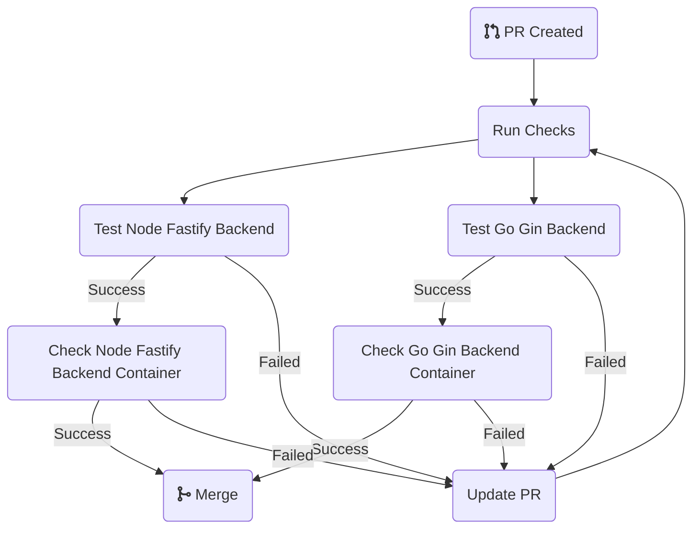
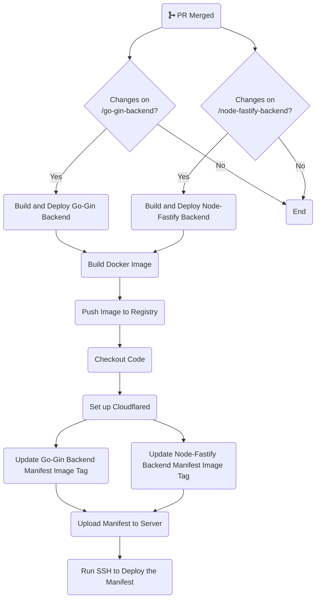

<!-- PROJECT LOGO -->
 

  

  <h2 align="center">The Monorepo for The A Organization</h2>

This repository hosts two backend services, one using Node.js and the other using Go. The Node.js backend utilizes the Fastify framework, while the Go backend employs the Gin framework. Both services are based on ready-to-use boilerplates.

## Node Fastify Backend
This backend uses a boilerplate from [jellydn/fastify-starter](https://github.com/jellydn/fastify-starter) and can be accessed via [https://node-fastify-backend.arprd.com](https://node-fastify-backend.arprd.com/). It is hosted on an on-premise server and tunneled using Cloudflare Zero Trust Tunnel. Some endpoints that can be hit are (taken from the boilerplate documentation):

| Endpoint                                                               | Method | Description                    |
| ---------------------------------------------------------------------- | ------ | ------------------------------ |
| [/health/check](https://node-fastify-backend.arprd.com/health/check)   | GET    | Get the service health status  |
| [/documentation](https://node-fastify-backend.arprd.com/documentation) | GET    | Open API documentation swagger |
| [/altair](https://node-fastify-backend.arprd.com/altair)               | GET    | Open GraphQL client IDE        |
| [/example](https://node-fastify-backend.arprd.com/example)             | GET    | Return {"hello":"world"}       |

## Go Gin Backend
This backend uses a boilerplate from [GenesisBlock3301/go-gin-boilerplate](https://github.com/GenesisBlock3301/go-gin-boilerplate) and can be accessed via [https://go-gin-backend.arprd.com](https://go-gin-backend.arprd.com). It is hosted on an on-premise server and tunneled using Cloudflare Zero Trust Tunnel. Some endpoints that can be hit are:

| Endpoint                                                             | Method | Description                   |
| -------------------------------------------------------------------- | ------ | ----------------------------- |
| [/health/check](https://go-gin-backend.arprd.com/health/check)       | GET    | Get the service health status |
| [/api/v1/books](https://go-gin-backend.arprd.com/api/v1/books)       | GET    | Get a list of books           |
| [/api/v1/books](https://go-gin-backend.arprd.com/api/v1/books)       | POST   | Create new book               |
| [/api/v1/books/:id](https://go-gin-backend.arprd.com/api/v1/books)   | GET    | Get a book by id              |
| [/api/v1/books/:id](https://go-gin-backend.arprd.com/api/v1/books)   | DELETE | Delete a book by id           |
| [/api/v1/register](https://go-gin-backend.arprd.com/api/v1/register) | POST   | Register new user             |
| [/api/v1/login](https://go-gin-backend.arprd.com/api/v1/login)       | POST   | Login to user                 |
| [/api/v1/user](https://go-gin-backend.arprd.com/api/v1/user)         | GET    | Get current user              |

## Contributions
To contribute to this repository, create a new Pull Request (PR). Once all checks are successful, ask the respective admin to review and merge it. The checks should only run if the corresponding folder is changed. For example, `ci-test-go-gin-backend` and `ci-check-go-gin-backend-container` should only run if changes are made inside `/go-gin-backend`. Outside of that, the checks should not be triggered.

### Pull Request CI Checks
- The `ci-test-go-gin-backend` and `ci-test-node-fastify-backend` will run unit tests based on the changes. If the tests fail, you cannot proceed with the merge. Please make the necessary changes until all tests pass.

- The `ci-check-go-gin-backend` and `ci-check-node-fastify-backend` will only run if the unit tests are successful. These checks verify if a container can be built and run correctly. First, an image is created and then run. After waiting for about 10 seconds to ensure the container is running, it will hit a `/health/check` endpoint. If the response is not 200, the container is considered unhealthy, and the checks will fail.

The diagram to show the PR flow can be seen below:

## Deployment

Continuous Deployment (CD) is automatically triggered by any push to the `main` branch, provided the updated path is in the specified list. The deployment is conditional based on the affected directories:
- The `cd-build-and-deploy-go-gin-backend-container` is triggered by changes within the `/go-gin-backend` folder.
- The `cd-build-and-deploy-node-fastify-backend-container` is triggered by changes within the `/node-fastify-backend` folder.

### `cd-build-and-deploy-go-gin-backend-container`
1. Set up QEMU and buildx.
2. Log in to Docker Hub.
3. Set the version for `tag-version`, which will be used to tag the container build.
4. Use `docker/build-push-action@v6` to build and push the image for both x64 and arm64 architectures.
5. Start the deployment process:
   - Check out the code from the repository.
   - Set up Cloudflared (as the on-premise server is behind a Cloudflare tunnel).
   - Update the `go-gin-backend-manifest` image with `tag-version` and send it to the server using SCP.
   - Execute an SSH command to deploy Kubernetes on the server.

### `cd-build-and-deploy-node-fastify-backend-container`
1. Set up QEMU and buildx.
2. Log in to Docker Hub.
3. Set the version for `tag-version`, which will be used to tag the container build.
4. Use `docker/build-push-action@v6` to build and push the image for both x64 and arm64 architectures.
5. Start the deployment process:
   - Check out the code from the repository.
   - Set up Cloudflared (as the on-premise server is behind a Cloudflare tunnel).
   - Update the `node-fastify-backend-manifest` image with `tag-version` and send it to the server using SCP.
   - Execute an SSH command to deploy Kubernetes on the server.

## Contact

Ariq Pradipa Santoso - ariq.pradipa@outlook.com

Project Link: [https://github.com/ariqpradipa/the-a-organization](https://github.com/ariqpradipa/the-a-organization)